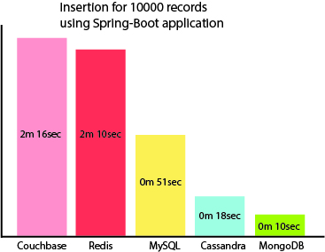

# This application utilizes 5 databases to compare their performance.

## NoSQL:

* Couchbase
* Cassandra
* MongoDB

## In-memory databases:

* Redis

## Relational DBMS:

* MySQL

Here I've left some images with charts representing my personal analyze for Insertion 10000 records and reading (
selection with System.out.println) 5000 records.

### Insertion 10000 records chart

### Reading (with println) time performance:

### Summary

Here I have to say a few words about each of databases:

* Couchbase - is powerful Key-Value storage. It has handy WEB UI to manage servers and buckets, convenient N1QL
  workbench which allows to run queries with SQL-like syntax. Couchbase showed up a slow performance while inserting
  data but not bad time for reading 5000 records.
* Redis - is an in-memory database, very simple to understand as it has a mild learning curve and users should learn a
  few basic commands to understand how to use it. But in my case, it represents a slow performance despite it's
  popularity and labelled as fast and performant database. (Maybe I didn't understand how deploy it properly).
* Cassandra - is a powerful NoSQL database based on schemas called - keyspaces. It is handy to use because it is based
  on convenient SQL-like syntax and users should learn a few aspects to understand differences between SQL and NoSQL
  syntax. It is a quite performant either inserting or reading data.
* MongoDB - in my opinion this one is very simple to understand due its JSON-like syntax, it manipulates data in JSON
  format and you can store data in whatsoever format, you don't need to adhere any rules, just do what you want, it's
  free to use save your data in chaotic manner. Also, this one is the best performant comparing to aforementioned ones.
* MySQL is a relational database management system for all the cases every programming could imagine. Very simple to
  learn due to low threshold. In my investigation it's turned out the most performant in any cases.

So, if we don't feel that we are really in need of using NoSQL databases I would recommend just keep going to use an old
good MySQL one.

P.S. This project is my personal investigation, and I don't to challenge this one to be the last word. As I've mentioned
earlier, I could deploy and set up my environment in incorrect way.   